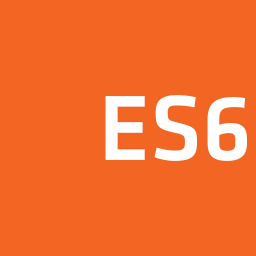
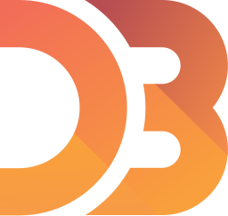
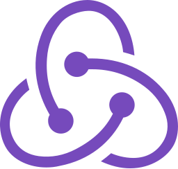
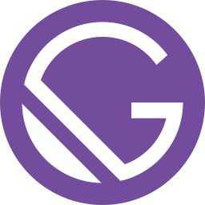
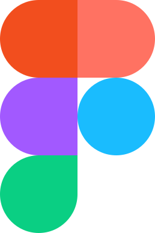
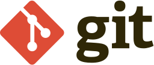

# 👋 Hello, I'm Fetian Ans Abo-hatb

A Software Engineer and a problem solver with experience and I have a strong passion for programming, specifically Web development, I love to work with new technologies and developing web applications .
- I’m have Bachelor of Software Engineering From KFS
- I'm a working as a React Developer.
- I'm a working as a ReactNative Developer.
- I’m a working as a Flutter Developer.
- I’m a working as a MERN Stack.

- 📫 How to reach me: If you'd like to get in touch, feel free to reach out to me at.
  - 📞 phone: +201009021622
  - 📧 Gmail: [fetianans.dev@gmail.com](mailto:fetianans.dev@gmail.com)

---

## 🔧 Skills

- 👨🏻‍💻 **Languages**: C++, Python, JavaScript, HTML, CSS
- 🛠️ **Frameworks and Libraries**: React.js, React Native, Node.js, Expo, Tailwind CSS, Qt
- 🛠️ **Tools**: Git
- 📚 **Databases**: MySQL, MongoDB
- 🛠️ **ORM/ODM**: Mongoose
- 🛠️ **Server Framework**: Express.js

---

### Frontend Technologies

  
  
  
  
  
  
  
  
  
  

### Backend Technologies

  
  
  
  
  
  
  
  

### Tools

  
  
  
  
  
   

         
         
        <b>عبارات تحفيزيه<b>
                   
<small >
لو ركزت على الى ضاع منك عمرك محتشوف اللى بيستناك شوف رزقك الدنيا واسعه
</small>
   
<small >
الماضى ممكن يوجع لكن من وجهه نظرى يتهرب منه يتتعلم منه
</small>
   
<small >
لازم تبقا مبتكر وقلبك جامد لازم تجرب حجات ممكن متنفعش ومتسمحش لاى حد يحجمك عيش حلمك
</small>

    
