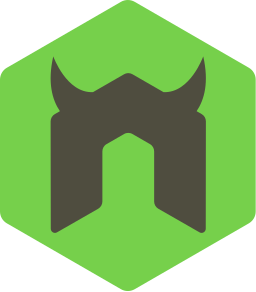

👋اهلا بك
## I'm Fetian Ans Abo-hatb
 

- 🔭 I’m currently working on  Bachelor of Software Engineering

- 🌱 I’m currently learning Web developer.

- 📫 How to reach me:
- phone: +2010090216
- Gmail: fetianans@gmail.com

<a href="https://fetian-ans.firebaseapp.com/" target="_blank">Portfolio</a>

        

<!--

أنا مبرمج ومطو ومنشئ محتوى ومحلل بيانات. التقنيات أستخدمها

### Frontend Technologies

  
  
  
  
  
  
  
  
  
  

### Backend Technologies

  
  
  
  
  
  
  
  

-->
<!--

### Tools

  
  
  
  
  
   

-->

         
         
        <b>عبارات تحفيزيه<b>
                   
<small >
لو ركزت على الى ضاع منك عمرك محتشوف اللى بيستناك شوف رزقك الدنيا واسعه
</small>
   
<small >
الماضى ممكن يوجع لكن من وجهه نظرى يتهرب منه يتتعلم منه
</small>
   
<small >
لازم تبقا مبتكر وقلبك جامد لازم تجرب حجات ممكن متنفعش ومتسمحش لاى حد يحجمك عيش حلمك
</small>

                  

